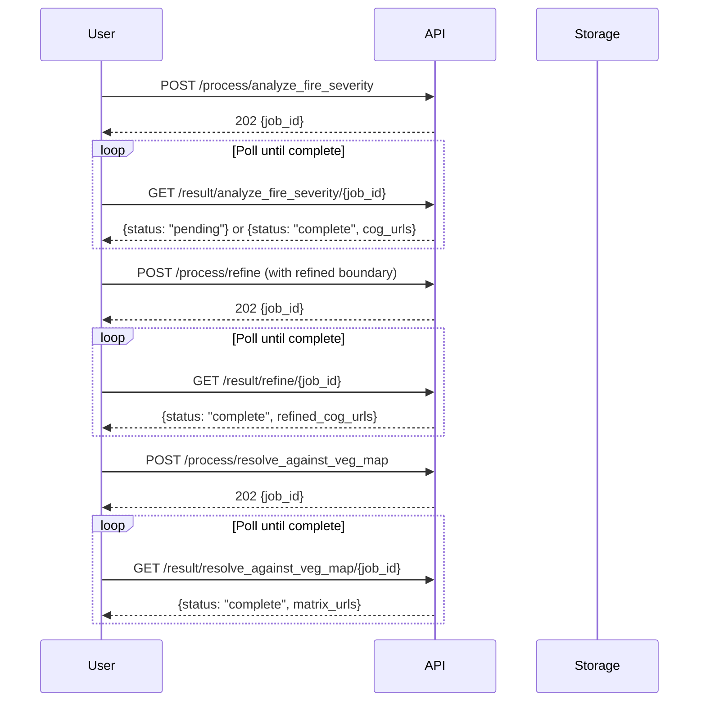

# Fire Recovery Backend API Endpoints

Detailed API documentation for the Fire Recovery Backend. For development setup, see [DEVELOPING.md](DEVELOPING.md).

## Base URL

- **Local Development:** `http://localhost:8000`
- **Production:** `https://fire-recovery-backend-<hash>.run.app`

All endpoints are prefixed with `/fire-recovery/`.

---

## Table of Contents

- [Fire Severity Analysis](#fire-severity-analysis)
  - [POST /process/analyze_fire_severity](#post-processanalyze_fire_severity)
  - [GET /result/analyze_fire_severity/{fire_event_name}/{job_id}](#get-resultanalyze_fire_severityfire_event_namejob_id)
- [Boundary Refinement](#boundary-refinement)
  - [POST /process/refine](#post-processrefine)
  - [GET /result/refine/{fire_event_name}/{job_id}](#get-resultrefinefire_event_namejob_id)
- [Vegetation Impact Analysis](#vegetation-impact-analysis)
  - [POST /process/resolve_against_veg_map](#post-processresolve_against_veg_map)
  - [GET /result/resolve_against_veg_map/{fire_event_name}/{job_id}](#get-resultresolve_against_veg_mapfire_event_namejob_id)
- [File Upload](#file-upload)
  - [POST /upload/geojson](#post-uploadgeojson)
  - [POST /upload/shapefile](#post-uploadshapefile)
- [Health Check](#health-check)
  - [GET /healthz](#get-healthz)

---

## Fire Severity Analysis

### POST /process/analyze_fire_severity

Initiates fire severity analysis using Sentinel-2 satellite imagery. This is an async operation that returns immediately with a job ID for polling.

#### Processing Pipeline

1. Queries Sentinel-2 L2A data from Microsoft Planetary Computer STAC
2. Creates temporal median composites for pre-fire and post-fire periods
3. Calculates spectral indices:
   - **NBR** (Normalized Burn Ratio): `(NIR - SWIR) / (NIR + SWIR)`
   - **dNBR** (Delta NBR): Absolute difference showing burn severity
   - **RdNBR** (Relativized dNBR): Normalized by pre-fire conditions
   - **RBR** (Relativized Burn Ratio): Best for low-biomass environments
4. Generates Cloud Optimized GeoTIFFs (COGs) for web visualization
5. Creates STAC metadata for asset discovery

#### Request

```bash
curl -X POST "http://localhost:8000/fire-recovery/process/analyze_fire_severity" \
  -H "Content-Type: application/json" \
  -d '{
    "fire_event_name": "Geology_Fire",
    "coarse_geojson": {
      "type": "Polygon",
      "coordinates": [[
        [-116.098276, 33.929925],
        [-116.098276, 33.880794],
        [-116.019318, 33.880794],
        [-116.019318, 33.929925],
        [-116.098276, 33.929925]
      ]]
    },
    "prefire_date_range": ["2023-06-01", "2023-06-09"],
    "postfire_date_range": ["2023-06-17", "2023-06-22"]
  }'
```

#### Request Body

| Field | Type | Required | Description |
|-------|------|----------|-------------|
| `fire_event_name` | string | Yes | Unique identifier for the fire event |
| `coarse_geojson` | GeoJSON | Yes | Polygon, MultiPolygon, or Feature defining the area of interest |
| `prefire_date_range` | string[] | Yes | Two ISO dates `[start, end]` for pre-fire imagery (2-3 weeks before ignition) |
| `postfire_date_range` | string[] | Yes | Two ISO dates `[start, end]` for post-fire imagery (2-3 weeks after containment) |

#### Response (202 Accepted)

```json
{
  "fire_event_name": "Geology_Fire",
  "status": "Processing started",
  "job_id": "223c86f1-377f-4640-ba88-ced1277f3831"
}
```

---

### GET /result/analyze_fire_severity/{fire_event_name}/{job_id}

Retrieves results of a fire severity analysis. Poll this endpoint until `status` is `"complete"`.

#### Request

```bash
curl "http://localhost:8000/fire-recovery/result/analyze_fire_severity/Geology_Fire/223c86f1-377f-4640-ba88-ced1277f3831"
```

#### Response (Pending)

```json
{
  "fire_event_name": "Geology_Fire",
  "status": "pending",
  "job_id": "223c86f1-377f-4640-ba88-ced1277f3831"
}
```

#### Response (Complete)

```json
{
  "fire_event_name": "Geology_Fire",
  "status": "complete",
  "job_id": "223c86f1-377f-4640-ba88-ced1277f3831",
  "coarse_severity_cog_urls": {
    "rbr": "https://storage.googleapis.com/fire-recovery-store/assets/223c86f1-377f-4640-ba88-ced1277f3831/fire_severity/rbr.tif",
    "dnbr": "https://storage.googleapis.com/fire-recovery-store/assets/223c86f1-377f-4640-ba88-ced1277f3831/fire_severity/dnbr.tif",
    "rdnbr": "https://storage.googleapis.com/fire-recovery-store/assets/223c86f1-377f-4640-ba88-ced1277f3831/fire_severity/rdnbr.tif"
  }
}
```

---

## Boundary Refinement

### POST /process/refine

Refines the fire boundary based on user-drawn geometry over severity visualization. Crops existing COGs to the refined boundary.

#### Use Case

After viewing the coarse fire severity results, users draw a more precise boundary on the map. This endpoint:
1. Downloads the original coarse COGs
2. Crops them to the refined boundary geometry
3. Creates new COGs with the refined extent
4. Updates STAC metadata

#### Request

```bash
curl -X POST "http://localhost:8000/fire-recovery/process/refine" \
  -H "Content-Type: application/json" \
  -d '{
    "fire_event_name": "Geology_Fire",
    "job_id": "223c86f1-377f-4640-ba88-ced1277f3831",
    "refined_geojson": {
      "type": "Polygon",
      "coordinates": [[
        [-116.08, 33.92],
        [-116.08, 33.89],
        [-116.03, 33.89],
        [-116.03, 33.92],
        [-116.08, 33.92]
      ]]
    }
  }'
```

#### Request Body

| Field | Type | Required | Description |
|-------|------|----------|-------------|
| `fire_event_name` | string | Yes | Must match the original analysis |
| `job_id` | string | Yes | Job ID from the original fire severity analysis |
| `refined_geojson` | GeoJSON | Yes | User-drawn refined boundary (Polygon, MultiPolygon, or Feature) |

#### Response (202 Accepted)

```json
{
  "fire_event_name": "Geology_Fire",
  "status": "Processing started",
  "job_id": "223c86f1-377f-4640-ba88-ced1277f3831"
}
```

---

### GET /result/refine/{fire_event_name}/{job_id}

Retrieves boundary refinement results.

#### Request

```bash
curl "http://localhost:8000/fire-recovery/result/refine/Geology_Fire/223c86f1-377f-4640-ba88-ced1277f3831"
```

#### Response (Complete)

```json
{
  "fire_event_name": "Geology_Fire",
  "status": "complete",
  "job_id": "223c86f1-377f-4640-ba88-ced1277f3831",
  "refined_boundary_geojson_url": "https://storage.googleapis.com/fire-recovery-store/assets/223c86f1-377f-4640-ba88-ced1277f3831/boundary/refined_boundary.geojson",
  "refined_severity_cog_urls": {
    "rbr": "https://storage.googleapis.com/fire-recovery-store/assets/223c86f1-377f-4640-ba88-ced1277f3831/fire_severity/refined_rbr.tif",
    "dnbr": "https://storage.googleapis.com/fire-recovery-store/assets/223c86f1-377f-4640-ba88-ced1277f3831/fire_severity/refined_dnbr.tif",
    "rdnbr": "https://storage.googleapis.com/fire-recovery-store/assets/223c86f1-377f-4640-ba88-ced1277f3831/fire_severity/refined_rdnbr.tif"
  }
}
```

---

## Vegetation Impact Analysis

### POST /process/resolve_against_veg_map

Analyzes fire severity impacts on vegetation communities using zonal statistics.

#### Processing Pipeline

1. Downloads vegetation map (GeoPackage) and fire severity COG
2. Clips data to the fire boundary
3. Performs zonal statistics using exactextract algorithm
4. Classifies continuous severity values into categories based on `severity_breaks`
5. Calculates area-weighted statistics by vegetation type
6. Generates CSV and JSON output files

#### Request

```bash
curl -X POST "http://localhost:8000/fire-recovery/process/resolve_against_veg_map" \
  -H "Content-Type: application/json" \
  -d '{
    "fire_event_name": "Geology_Fire",
    "job_id": "223c86f1-377f-4640-ba88-ced1277f3831",
    "veg_gpkg_url": "https://storage.googleapis.com/nps-veg-data/JOTR_vegetation.gpkg",
    "fire_cog_url": "https://storage.googleapis.com/fire-recovery-store/assets/223c86f1-377f-4640-ba88-ced1277f3831/fire_severity/refined_rbr.tif",
    "geojson_url": "https://storage.googleapis.com/fire-recovery-store/assets/223c86f1-377f-4640-ba88-ced1277f3831/boundary/refined_boundary.geojson",
    "severity_breaks": [0.1, 0.27, 0.44, 0.66],
    "park_unit_id": "JOTR"
  }'
```

#### Request Body

| Field | Type | Required | Description |
|-------|------|----------|-------------|
| `fire_event_name` | string | Yes | Fire event identifier |
| `job_id` | string | Yes | Job ID from fire severity analysis |
| `veg_gpkg_url` | string | Yes | URL to NPS vegetation GeoPackage |
| `fire_cog_url` | string | Yes | URL to fire severity COG (typically RBR) |
| `geojson_url` | string | Yes | URL to fire boundary GeoJSON |
| `severity_breaks` | float[] | Yes | Classification thresholds (e.g., `[0.1, 0.27, 0.44, 0.66]` for unburned/low/moderate/high) |
| `park_unit_id` | string | No | Park unit code for vegetation schema (e.g., `"JOTR"`, `"MOJN"`). Auto-detected if omitted. |

#### Severity Classification

The `severity_breaks` array defines thresholds for classifying continuous RBR values:

| RBR Range | Classification | Description |
|-----------|----------------|-------------|
| < 0.1 | Unburned | No significant fire effect |
| 0.1 - 0.27 | Low | Light surface burn |
| 0.27 - 0.44 | Moderate | Moderate canopy damage |
| 0.44 - 0.66 | High | Significant vegetation loss |
| > 0.66 | Very High | Complete vegetation removal |

#### Response (202 Accepted)

```json
{
  "fire_event_name": "Geology_Fire",
  "status": "Processing started",
  "job_id": "223c86f1-377f-4640-ba88-ced1277f3831"
}
```

---

### GET /result/resolve_against_veg_map/{fire_event_name}/{job_id}

Retrieves vegetation impact analysis results.

#### Request

```bash
curl "http://localhost:8000/fire-recovery/result/resolve_against_veg_map/Geology_Fire/223c86f1-377f-4640-ba88-ced1277f3831?severity_breaks=0.1&severity_breaks=0.27&severity_breaks=0.44&severity_breaks=0.66"
```

#### Query Parameters

| Parameter | Type | Required | Description |
|-----------|------|----------|-------------|
| `severity_breaks` | float[] | No | Must match the breaks used in the POST request for correct result lookup |

#### Response (Complete)

```json
{
  "fire_event_name": "Geology_Fire",
  "status": "complete",
  "job_id": "223c86f1-377f-4640-ba88-ced1277f3831",
  "fire_veg_matrix_csv_url": "https://storage.googleapis.com/fire-recovery-store/assets/223c86f1-377f-4640-ba88-ced1277f3831/veg_analysis/fire_veg_matrix.csv",
  "fire_veg_matrix_json_url": "https://storage.googleapis.com/fire-recovery-store/assets/223c86f1-377f-4640-ba88-ced1277f3831/veg_analysis/fire_veg_matrix.json"
}
```

#### Output JSON Structure

The JSON output contains vegetation impact data for dashboard visualization:

```json
{
  "vegetation_types": [
    {
      "name": "Mojave Creosote Bush Scrub",
      "color": "#8B7355",
      "total_hectares": 1250.5,
      "percentage_of_fire": 45.2,
      "severity_breakdown": {
        "unburned": {"hectares": 125.0, "percentage": 10.0},
        "low": {"hectares": 375.2, "percentage": 30.0},
        "moderate": {"hectares": 500.3, "percentage": 40.0},
        "high": {"hectares": 250.0, "percentage": 20.0}
      },
      "mean_severity": 0.34,
      "std_severity": 0.15
    }
  ],
  "summary": {
    "total_hectares": 2766.8,
    "vegetation_types_count": 12
  }
}
```

---

## File Upload

### POST /upload/geojson

Uploads a GeoJSON boundary directly.

#### Request

```bash
curl -X POST "http://localhost:8000/fire-recovery/upload/geojson" \
  -H "Content-Type: application/json" \
  -d '{
    "fire_event_name": "Geology_Fire",
    "geojson": {
      "type": "Polygon",
      "coordinates": [[
        [-116.098276, 33.929925],
        [-116.098276, 33.880794],
        [-116.019318, 33.880794],
        [-116.019318, 33.929925],
        [-116.098276, 33.929925]
      ]]
    },
    "boundary_type": "refined"
  }'
```

#### Request Body

| Field | Type | Required | Description |
|-------|------|----------|-------------|
| `fire_event_name` | string | Yes | Fire event identifier |
| `geojson` | GeoJSON | Yes | Polygon, MultiPolygon, or Feature geometry |
| `boundary_type` | string | No | `"coarse"` or `"refined"` (default: `"coarse"`) |

#### Response

```json
{
  "fire_event_name": "Geology_Fire",
  "status": "complete",
  "job_id": "223c86f1-377f-4640-ba88-ced1277f3831",
  "refined_boundary_geojson_url": "https://storage.googleapis.com/fire-recovery-store/assets/223c86f1-377f-4640-ba88-ced1277f3831/boundary/refined_boundary.geojson",
  "boundary_type": "refined"
}
```

---

### POST /upload/shapefile

Uploads a zipped shapefile for boundary definition.

#### Request

```bash
curl -X POST "http://localhost:8000/fire-recovery/upload/shapefile" \
  -F "fire_event_name=Geology_Fire" \
  -F "shapefile=@fire_boundary.zip" \
  -F "boundary_type=refined"
```

#### Form Fields

| Field | Type | Required | Description |
|-------|------|----------|-------------|
| `fire_event_name` | string | Yes | Fire event identifier |
| `shapefile` | file | Yes | Zipped shapefile (.zip containing .shp, .shx, .dbf, .prj) |
| `boundary_type` | string | No | `"coarse"` or `"refined"` (default: `"refined"`) |

#### Response

```json
{
  "fire_event_name": "Geology_Fire",
  "status": "complete",
  "job_id": "223c86f1-377f-4640-ba88-ced1277f3831",
  "shapefile_url": "https://storage.googleapis.com/fire-recovery-store/assets/223c86f1-377f-4640-ba88-ced1277f3831/boundary/boundary.zip",
  "boundary_geojson_url": "https://storage.googleapis.com/fire-recovery-store/assets/223c86f1-377f-4640-ba88-ced1277f3831/boundary/boundary.geojson",
  "boundary_type": "refined"
}
```

---

## Health Check

### GET /healthz

System health check endpoint. Verifies connectivity to storage and other dependencies.

#### Request

```bash
curl "http://localhost:8000/fire-recovery/healthz"
```

#### Response (Healthy)

```json
{
  "fire_event_name": "health-check",
  "status": "healthy",
  "job_id": "223c86f1-377f-4640-ba88-ced1277f3831",
  "overall_status": "healthy",
  "timestamp": 1706486400.123,
  "checks": {
    "storage": {"status": "healthy", "latency_ms": 45},
    "stac": {"status": "healthy", "latency_ms": 12}
  },
  "unhealthy_components": 0
}
```

---

## Common Response Codes

| Code | Description |
|------|-------------|
| 200 | Success |
| 202 | Accepted (async processing started) |
| 400 | Bad Request (invalid input) |
| 404 | Not Found |
| 422 | Validation Error (invalid request body) |
| 500 | Internal Server Error |
| 503 | Service Unavailable (health check failed) |

---

## Typical Workflow


